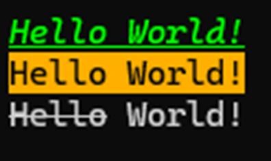

# cmd
C++ stream manipulators for console control using ANSI/xterm control sequences.

## Provides std::ostream manipulators for:
* Clearing the screen and lines
* Cursor visibility control
* Set 8-bit and 24-bit (True Color) text and background colors
* Use of various text modes (bold, underlined, inverted, etc.)

For more information about ANSI control sequences see:
https://gist.github.com/fnky/458719343aabd01cfb17a3a4f7296797

## Compatibility
Any terminals with ANSI/xterm control sequence support

## Installing
Just copy **cmd.hpp** to your C++ project and use manipulators from **cmd** namespace.

This namespace also declares the standard ANSI streams and manipulators from std. See **cmd.hpp** for details.

## Dependencies
```C++
#include <iostream>
```

## Usage
```C++
#include "cmd.hpp"

int main()
{
	// Set green text color (True color)
	cmd::cout << cmd::text_color(0, 255, 0);
	// Set italic
	cmd::cout << cmd::italic_begin;
	// Set underline
	cmd::cout << cmd::underline_begin;

	cmd::cout << "Hello World!" << cmd::endl;

	// Disable italic and underline
	cmd::cout << cmd::italic_end << cmd::underline_end;

	// Set black text
	cmd::cout << cmd::clr_black;
	// Set orange background
	cmd::cout << cmd::bkg_clr_orange;

	cmd::cout << "Hello World!" << cmd::endl;

	// Reset styles and color
	cmd::cout << cmd::reset;

	// Write a strikethrough text
	cmd::cout << cmd::strikethrough_begin << "Hello" << cmd::strikethrough_end;
	// Write default text
	cmd::cout << " World!" << cmd::endl;
	return 0;
}
```
Output:



## License
Public domain. I wrote it for myself and decided to post it so as not to lose it.